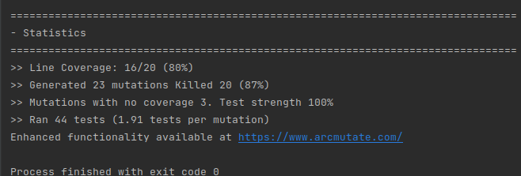

# Balanced strings

A string containing grouping symbols `{}[]()` is said to be balanced if every open symbol `{[(` has a matching closed symbol `]}` and the substrings before, after and between each pair of symbols is also balanced. The empty string is considered as balanced.

For example: `{[][]}({})` is balanced, while `][`, `([)]`, `{`, `{(}{}` are not.

Implement the following method:

```java
public static boolean isBalanced(String str) {
    ...
}
```

`isBalanced` returns `true` if `str` is balanced according to the rules explained above. Otherwise, it returns `false`.

Use the coverage criteria studied in classes as follows:

1. Use input space partitioning to design an initial set of inputs. Explain below the characteristics and partition blocks you identified.

2. Evaluate the statement coverage of the test cases designed in the previous step. If needed, add new test cases to increase the coverage. Describe below what you did in this step.

3. If you have in your code any predicate that uses more than two boolean operators check if the test cases written so far satisfy *Base Choice Coverage*. If needed add new test cases. Describe below how you evaluated the logic coverage and the new test cases you added.

4. Use PIT to evaluate the test suite you have so far. Describe below the mutation score and the live mutants. Add new test cases or refactor the existing ones to achieve a high mutation score.

Write below the actions you took on each step and the results you obtained.

Use the project in [tp3-balanced-strings](../code/tp3-balanced-strings) to complete this exercise.

## Answer

1.

For the characteristics we identified the number of '([{' of opened and the number of closed '([{'

Characteristics :
	
- Type :		[	{	(

- Number open 	:	m	n
- Number close	:	m	n	
	
So there is 9 blocks to test : 

- for { : n&n and n&m and m&n
- for ( : n&n and n&m and m&n
- for [ : n&n and n&m and m&n

2. 

We are covering 9 statements and we are not covering cases with several '([{' in the same time. There are 3 ways to combine them together : '([', '{[', '({'.
So adding with this Characteristic there will 9*3 = 27 blocks
So statement coverage = 9 / 27 = 33%
But it is possible to argue that not all them are useful.

3. 

In the code there is one place where we have used more than 1 predicate. It is this line : ``` if(res[i] == '(' || res[i] == '[' || res[i] == '{') ```
With the current test already coverring this test cases.

4.

First of all, we needed to find a way to launch Pit, for that we decided to use Intellij extension.

As you can see on the image the mutation score is 87%. It remains 3 mutantes alives :



They all come from :
``` org.pitest.mutationtest.engine.gregor.mutators.returns.BooleanTrueReturnValsMutator```

On this case we think that this is not a problem of test case but just a coincidence. Pit think that the tests should return false but even if the mutation the result is correct.