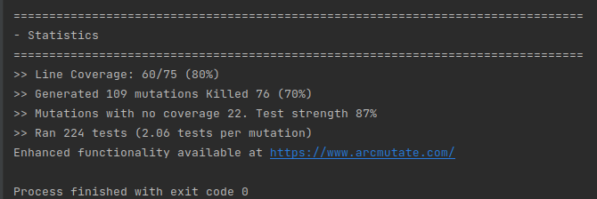

# Test the Date class

Implement a class `Date` with the interface shown below:

```java
class Date implements Comparable<Date> {

    public Date(int day, int month, int year) { ... }

    public static boolean isValidDate(int day, int month, int year) { ... }

    public static boolean isLeapYear(int year) { ... }

    public Date nextDate() { ... }

    public Date previousDate { ... }

    public int compareTo(Date other) { ... }

}
```

The constructor throws an exception if the three given integers do not form a valid date.

`isValidDate` returns `true` if the three integers form a valid year, otherwise `false`.

`isLeapYear` says if the given integer is a leap year.

`nextDate` returns a new `Date` instance representing the date of the following day.

`previousDate` returns a new `Date` instance representing the date of the previous day.

`compareTo` follows the `Comparable` convention:

* `date.compareTo(other)` returns a positive integer if `date` is posterior to `other`
* `date.compareTo(other)` returns a negative integer if `date` is anterior to `other`
* `date.compareTo(other)` returns `0` if `date` and `other` represent the same date.
* the method throws a `NullPointerException` if `other` is `null` 

Design and implement a test suite for this `Date` class.
You may use the test cases discussed in classes as a starting point. 
Also, feel free to add any extra method you may need to the `Date` class.


Use the following steps to design the test suite:

1. With the help of *Input Space Partitioning* design a set of initial test inputs for each method. Write below the characteristics and blocks you identified for each method. Specify which characteristics are common to more than one method.

2. Evaluate the statement coverage of the test cases designed in the previous step. If needed, add new test cases to increase the coverage. Describe below what you did in this step.

3. If you have in your code any predicate that uses more than two boolean operators check if the test cases written to far satisfy *Base Choice Coverage*. If needed add new test cases. Describe below how you evaluated the logic coverage and the new test cases you added.

4. Use PIT to evaluate the test suite you have so far. Describe below the mutation score and the live mutants. Add new test cases or refactor the existing ones to achieve a high mutation score.

Use the project in [tp3-date](../code/tp3-date) to complete this exercise.

## Answer

1.

- isValidDate method :

The characteristics are the months and the days

```

                Month = 2       Month = 1, 2, 4, 7, 8, 10, 12       Month = 3, 5, 9, 11

Day

< 1            not              not                                 not

\> 27           cf Year          ok                                  ok

\> 28           cf Year          ok                                  ok

\> 29           not              ok                                  ok

\> 30           not              not                                 ok

\> 31           not              not                                 not

```

Here there is 6*3 = 18 blocks identified here if we not count the 2 "cf Year". Indeed with these both cases the result is bigger because we have to look for 2 different years (Leap and not leap) the result.


- isLeapYear method :

The characteristic are the different type of years:

```

Year                                            

year%4 != 0                                     True            False

year%4 == 0 and year%100 != 0                   True            False

year%4 == 0 and year%100 == 0 and year%400      True            False

```

There is 6 blocks identified.


- nextDate method :

The characteristics are the different the month and the day:


```

        Day     <27      28      29      30      31

Month

< 11

12

```

There is 12 * 31 = 372 blocks but only the ones which testing tricky cases are interesting to do. So (7*5) 35 blocks.

- previousDate :

The characteristics are the different the month and the day:

```

        Day     1       >1

Month

1               

>1

```

As previoulsy there is 372 blocks but only 4 here which are interesting to check.

- compareTo method :

The characteristics are the different the month, the day and the year :

```
. year1 < year2

. month1 < month2

. day1 < day2
```

We can not represent the tab here because it would need to do it in 3 dimensions (year, month, day) :

Despite that we can say, by reasoning, that the number of blocks is 2^3 = 8.

2. 

- IsValideDate : 8/18 = 0.44

- IsLeapYear : 6 / 6 = 1

- testNextDate : 4 / 35 = 0.11

- testPreviousDate : 3 / 4 = 0.75

- compareTo : 6 / 8 = 0.75

3. 

With statement coverage equals (cf above) to 100%, no predicate with more than two boolean operator are not tested

4.

As previous we decided to use Intellij extension.

The mutation score is 70%. It remains 35 mutantes alives :



---

The tests could have been more exaustive if we have more time. And it could have been better with more time.